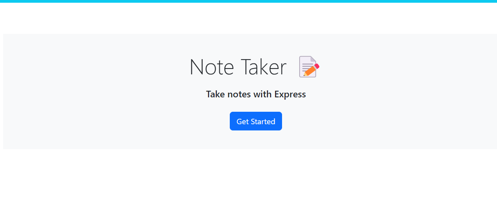
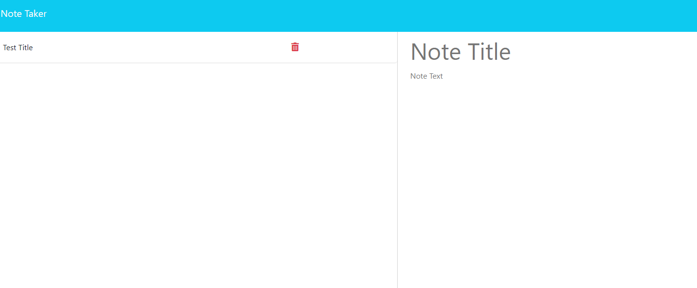

# Note-taker-redone

# Table of Contents
- Description
- Installation
- Usage
- License
- Screenshot
- Github URL
- Live URL

# Description
This note taker application is intended to be used for taking, saving, and deleting notes.

# Installation
- Before installing this app to your local system you must first download Node.js and Express.js.
- Next, clone the repo into the command line or terminal.
- Finally to start the application in the terminal write `node server.js` .
- Or alternatively click the Live URL to use.

# Usage
The user will be able to write down notes that include the title of the note and the information in the text area. Afterwards the user has the option of saving it, if the user wishes to delete the saved note, they will be able to by clicking the small red trash icon next to the saved notes.

# License
This application uses an MIT license.

# Screenshot:

# Github URL:
https://github.com/jesusprz24/Note-taker-redone

# Live URL: 
This application is deployed using Heroku.

https://note-taker-redone.herokuapp.com/

